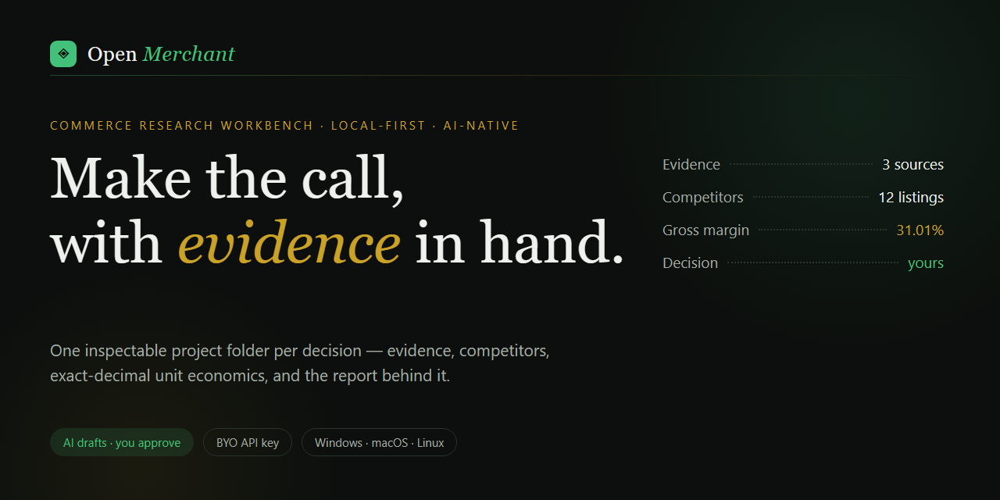
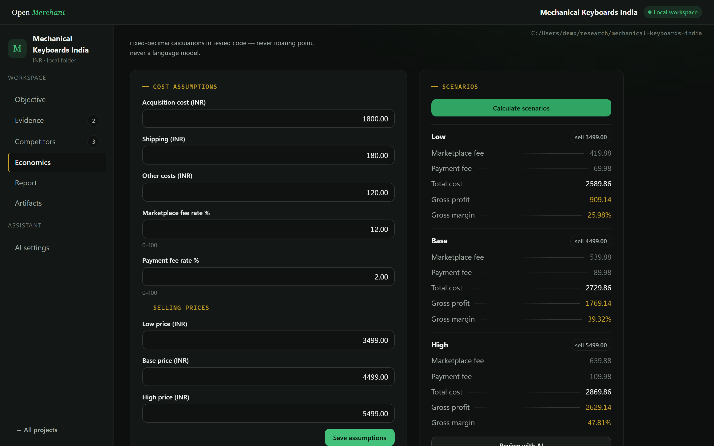
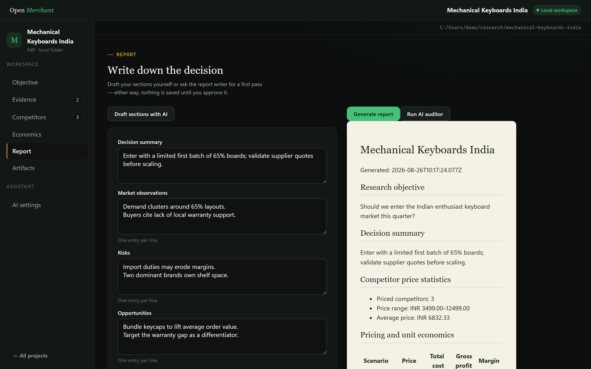

# Open Merchant



Open Merchant is a local-first, AI-native desktop workbench for deciding whether a product opportunity is commercially worth pursuing — without losing the evidence, assumptions, calculations, and report behind the decision.

It is built for solo ecommerce sellers, founders, and product researchers who want one inspectable project folder per decision instead of scattered tabs, spreadsheets, and notes. AI assistants draft; you approve every step. Your files stay on your machine.

## What Open Merchant does

Create a project folder, record a research objective and evidence, compare competitor listings, enter cost assumptions and selling-price scenarios, calculate deterministic unit economics, and generate an evidence-linked Markdown opportunity report. AI assistants can draft evidence entries, report sections, research plans, and integrity checks — but every draft is clearly marked and nothing is saved until you accept it.

## Platforms

Windows, macOS, and Linux. Built on Electron with a TypeScript monorepo.

## A look inside

| | |
|---|---|
|  |  |
| *Unit economics — exact decimals, ledger-style rows* | *The opportunity report, rendered as a paper document* |

More views: [home](docs/media/app-home.png) · [objective](docs/media/app-objective.png) · [evidence](docs/media/app-evidence.png) · [competitors](docs/media/app-competitors.png) · [artifacts & history](docs/media/app-artifacts.png)

## The AI copilot

Open Merchant ships with six specialist assistants rather than one chatbot:

| Assistant | What it drafts |
| --- | --- |
| Research planner | A checklist of evidence to gather for your objective |
| Evidence assistant | Structured sources from material you paste in |
| Competitor analyst | Competitor listing entries from pasted listings |
| Economics reviewer | Sanity flags on your assumptions versus market prices |
| Report writer | Decision summary, observations, risks, opportunities |
| Auditor | Whether your drafted claims are backed by recorded evidence |

Ground rules:

- **Bring your own key.** Add an Anthropic or OpenAI API key in AI settings. Keys are encrypted with OS-backed credential storage and never appear in project folders, artifacts, or logs.
- **Drafts are not saves.** Assistant output enters the UI marked as an AI draft; it becomes project data only when you edit and save it.
- **Provenance follows the machine.** Accepted AI content is journaled with the agent id, provider, model, prompt hash, and artifact fingerprint.
- **No autonomous browsing.** Assistants read only what you paste into them.
- Commerce math is never done by an AI or by floating point — see below.

## Workspace format

Each project is an ordinary directory that you own and can inspect outside the app:

```text
my-project/
  .openmerchant/
    manifest.json          # identity, objective, currency, schema version
    runs.jsonl             # meaningful operations (create, calculate, generate…)
    provenance.jsonl       # generated artifacts -> run, sha256, AI origin
  evidence/sources.jsonl   # user-owned inputs
  market/competitors.json  # user-owned inputs
  economics/assumptions.json
  economics/scenarios.json # generated from assumptions
  reports/report-sections.json
  reports/opportunity-report.md # generated
```

All writes are atomic replace-on-success: an interrupted save leaves the previous file intact. Malformed files are rejected loudly, never silently repaired. Projects created by Open Merchant V0 (schema version 1) can be migrated via **Import legacy project** on the Home screen.

## Deterministic calculations

All commerce math runs in tested application code using arbitrary-precision decimals — not an LLM, not binary floating point. Rounding is half-away-from-zero to two decimal places, applied only when a value is emitted:

```text
marketplace fee = selling price × marketplace fee rate / 100
payment fee     = selling price × payment fee rate / 100
total cost      = acquisition + shipping + fees + other costs
gross profit    = selling price − total cost
gross margin    = gross profit / selling price × 100
```

Competitor statistics ignore unpriced listings and report min, max, average, and median of valid prices only. The current engine's outputs are pinned against golden fixtures derived from the original Rust implementation.

## Development

Prerequisites: Node.js 22+, pnpm 9+, Git.

```bash
pnpm install
pnpm dev        # run the desktop app
pnpm test       # all package tests
pnpm lint       # eslint
pnpm typecheck  # strict TS across the monorepo
```

### Repository layout

```text
apps/desktop/      Electron app (main, preload, renderer)
packages/shared/   Zod schemas: artifacts, IPC contract, errors, agent outputs
packages/core/     Domain engine: exact-decimal money, economics, statistics,
                   validation, report rendering, atomic workspace store,
                   path guards, run/provenance journals, V0 import
packages/ai/       Provider-agnostic LLM seam (Anthropic/OpenAI adapters,
                   mock provider) and the specialist agents
packages/sdk/      Typed DesktopClient over the validated IPC contract +
                   in-memory mock client
packages/ui/       Design tokens and primitives ("The Merchant's Ledger")
examples/          Demo project (marked demo data, not live claims)
docs/              Architecture notes and release checks
```

The renderer never imports Electron: everything crosses the single zod-validated IPC contract exposed through `packages/sdk`.

### Packaging

```bash
pnpm --filter @open-merchant/desktop dist
```

Produces an unsigned NSIS installer (Windows), DMG (macOS), or AppImage (Linux) under `apps/desktop/release`. Your operating system may warn about unsigned builds; review the source and build provenance before installing.

## Current limitations

- No cloud sync, accounts, teams, or mobile clients.
- Assistants cannot browse: you supply page content by pasting it.
- One writer per project at a time; do not edit a project elsewhere while Open Merchant has unsaved changes.
- The checked-in example project contains clearly-marked demo data, not live commercial claims.

## License

Open Merchant is licensed under the GNU Affero General Public License v3.0 only (`AGPL-3.0-only`).

Copyright © 2026 Xeyronox.
