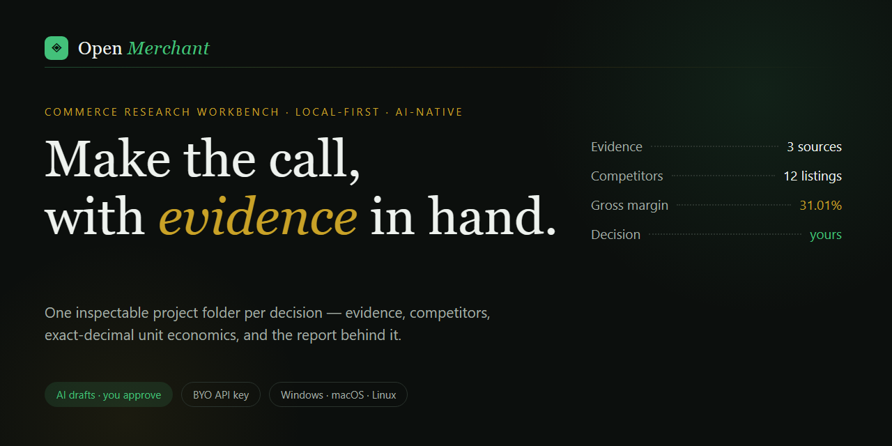
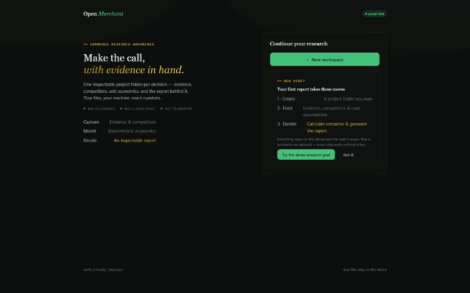
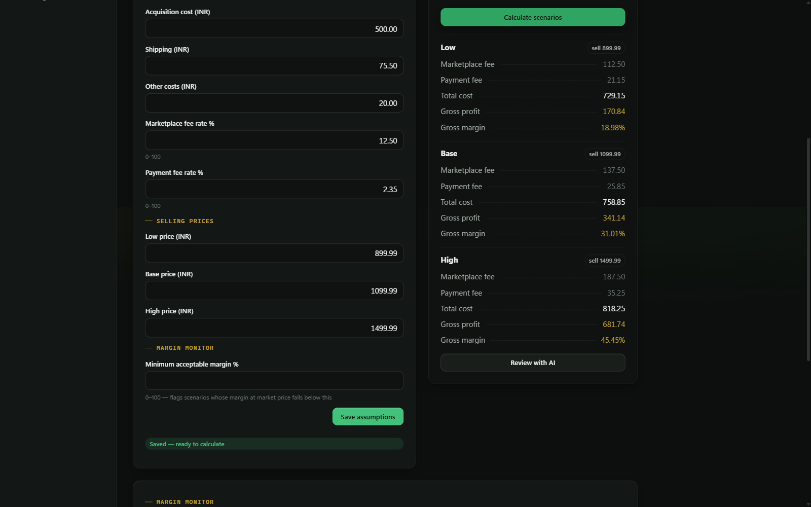
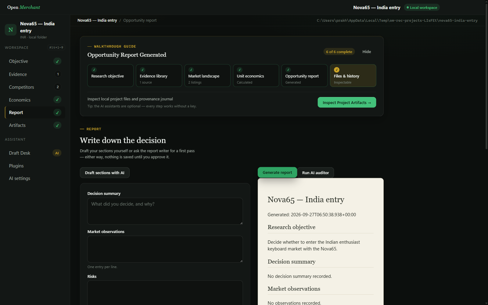

# Open Merchant



A desktop workbench for deciding whether a product is worth pursuing, and for keeping the evidence
behind that decision.

Every decision gets its own folder on your own disk. Nothing is uploaded, nothing is locked in, and
nothing happens without you pressing the button. The arithmetic is done in exact decimals by tested
code — never by a language model, never by floating point. A language model can draft for you, but it
cannot write anything into your project until you accept it.

**Version 1.0.0.** [Releases](https://github.com/getxeyronoxz/open-merchant/releases) ·
[Roadmap](ROADMAP.md) · [Architecture](docs/architecture.md)

---

## The loop

Create a project. Write down what you want to know. Record the evidence. Compare what everyone else
is charging. Enter what it costs you. Calculate the margin. Write the report.

That is the whole product, and it is meant to be repeatable — for the next product, and the one after
that.

Around that loop sit a few things that turn out to matter more than expected:

- **Price history you can actually check.** Capture a snapshot of the market whenever you look. Over
  time you can answer "what did this listing cost the first time I saw it?" without guessing.
- **A margin monitor that watches for you.** Scenarios recompute against the newest snapshot, and the
  app flags it when market drift pushes a scenario past the threshold you set.
- **A decision journal.** Every report is a dated entry. Put two side by side, see what changed, and
  find out whether you would still make the call today.
- **A portfolio view.** Every project on one screen, worst margin first.
- **A restatement when the currency changes.** Enter the rate yourself — no network, no live feed —
  and every amount in the project is restated in exact decimals, after you have seen the
  before-and-after. Percentages stay percentages.
- **File-first, properly.** Spreadsheet import with row-by-row validation and stated reasons for
  rejected rows, CSV export, a printable report, and a single-file archive for backup.

## A look inside



| | |
|---|---|
|  |  |
| *Unit economics — exact decimals, ledger-style rows* | *The opportunity report, rendered as a paper document* |

More views: [home](docs/media/app-home.png) · [objective](docs/media/app-objective.png) · [evidence](docs/media/app-evidence.png) · [competitors](docs/media/app-competitors.png) · [artifacts & history](docs/media/app-artifacts.png) · [the Draft Desk](docs/media/app-draft-desk.png)

## Assistants

Six specialists, all of them optional, all of them drafts. Bring your own key — Anthropic, OpenAI,
Google Gemini, or a local endpoint (Ollama, LM Studio, anything OpenAI-compatible) that needs no key
at all and never talks to a cloud. Cloud keys are sealed with your operating system's credential
storage and never appear in project folders, artifacts, or logs.

| Assistant | What it drafts |
| --- | --- |
| Research planner | A checklist of evidence to gather for your objective |
| Evidence assistant | Structured sources from material you paste in |
| Competitor analyst | Competitor listing entries from pasted listings |
| Economics reviewer | Sanity flags on your assumptions against market prices |
| Report writer | Decision summary, observations, risks, opportunities |
| Auditor | Whether your drafted claims are backed by recorded evidence |

A draft arrives marked as one. It becomes project data when you edit and save it, and then — and only
then — the run is journaled with the agent, provider, model, prompt hash, and a fingerprint of the
artifact. Assistants read what you paste into them. Nothing browses anything on its own.

**Getting around.** The toolbar always shows where you are: project, section, and the folder on disk.
`Alt+1…9` jumps between sections. A walkthrough guide keeps the six steps a click away with progress
badges, and reopening a project resumes at its first incomplete step. The Draft Desk collects every
draft from every assistant into one lane you can work through with the arrow keys.

## Letting your AI read the record

Open Merchant ships a local, read-only MCP server, so an assistant can read a project's evidence,
competitors, snapshots, economics, and reports. It runs over stdio. There is no network socket in it,
nothing to authenticate, and nothing leaves your machine.

It cannot write. The server registers no tools at all, so a write attempt is refused at the protocol
level rather than by a check that could be bypassed. Every read appends one record to that project's
`runs.jsonl`, so an agent reading your folder leaves the same kind of trace you would.

The server ships inside the app. **Plugins → "Let your AI read the record"** gives you the exact
command and a config to paste, and asks which host you use first — because hosts genuinely disagree.
opencode reads an `mcp` key with the transport spelled `local` and the command as an array; Claude
Code and Claude Desktop read `mcpServers` with `stdio`, a string command, and a separate `args`.
[`docs/mcp-hosts.md`](docs/mcp-hosts.md) has both, with the sources they came from.

## Plugins and connectors

A plugin is a folder of data, not code this app loads. Put one in the `plugins` directory and it
appears on the Plugins screen — disabled, with its declared source one click away, so nothing a
stranger wrote is turned on before you have read what it says it is.

| Platform | Plugins directory |
| --- | --- |
| Windows | `%APPDATA%\@open-merchant\desktop\plugins` |
| macOS | `~/Library/Application Support/@open-merchant/desktop/plugins` |
| Linux | `~/.config/@open-merchant/desktop/plugins` |

The screen shows you the exact path when the list is empty. Every plugin declares what it wants —
`reads`, `writes`, `network`, and the minimum app version it was written for. A plugin needing a
newer build than yours is refused and listed with the reason. Nothing is dropped silently.

`network: true` is a contract you accept, not a limit the app can enforce: Node cannot stop a spawned
process from opening a socket. The Plugins screen tells you which plugins ask for it.

A **connector** is the one kind that runs something — an external process speaking MCP over stdio. It
has to declare `writes: ["drafts"]`, and what it returns lands on the Draft Desk as drafts tagged with
its id and a hash of the raw response, never dressed up as something a model produced. A fetch
writes nothing to your project at all.

A runnable one is in [`examples/sample-connector`](examples/sample-connector): no dependencies, no
`npm install`, no network, returning clearly-marked sample listings. Copy the folder across to see the
whole path work.

## Installing

Grab the installer for your platform from
[GitHub Releases](https://github.com/getxeyronoxz/open-merchant/releases):

| | |
| --- | --- |
| **Windows** | `.exe` (NSIS) |
| **macOS** | `.dmg` |
| **Linux** | `AppImage`, `.deb`, `.tar.gz`, snap, flatpak |

The app keeps itself current. It checks the project's own Releases feed at launch and every six hours
after, downloads in the background, and offers to restart — or applies the change when you quit. The
check is a passive read of a public feed; nothing about your projects is involved. The strip in the
corner tells you which of those things actually happened, including when the check itself failed.

### Before CA signing

**A note for anyone installing this.** Open Merchant is an independent project and is not registered
in Microsoft's or Apple's developer registries — those cost money. Your operating system may
therefore flag the installer on first launch. The warning comes from the missing certificate, not
from the software:

- **Windows** — SmartScreen may say *"Windows protected your PC"*. Choose **More info → Run anyway**.
  It may also say "unknown publisher"; installation proceeds either way.
- **macOS** — Gatekeeper blocks the first launch. Open **System Settings → Privacy & Security** and
  click **Open Anyway**, or right-click the app → **Open**. On Apple Silicon,
  `xattr -cr "/Applications/Open Merchant.app"` clears it in one step.
- **Linux** — nothing to do. On the AppImage, `chmod +x` and run it. If it refuses with a missing
  `libfuse.so.2`, that is FUSE rather than a bad download: install `fuse2` from the AUR, run it with
  `--appimage-extract-and-run`, or use the `.deb` or `.tar.gz` build.

A CA-issued certificate is on the [roadmap](ROADMAP.md) and will remove these warnings on its own.

## Your project folder

An ordinary directory you own and can read without this app:

```text
my-project/
  .openmerchant/
    manifest.json          # identity, objective, currency, schema version
    runs.jsonl             # meaningful operations (create, calculate, generate…)
    provenance.jsonl       # generated artifacts -> run, sha256, origin
  evidence/sources.jsonl   # your inputs
  market/competitors.json  # your inputs
  economics/assumptions.json
  economics/scenarios.json # generated
  reports/report-sections.json
  reports/opportunity-report.md # generated
```

Writes are atomic: an interrupted save leaves the previous file exactly as it was. A malformed file is
rejected loudly rather than quietly repaired — if something is wrong with your project, you are told
what, not handed a plausible-looking guess. Projects from schema version 1 can be brought forward
with **Import legacy project** on the Home screen.

## The arithmetic

Exact decimals, in tested code. Not a language model, not floating point. Rounding is
half-away-from-zero to two places, and only when a value is written out:

```text
marketplace fee = selling price × marketplace fee rate / 100
payment fee     = selling price × payment fee rate / 100
total cost      = acquisition + shipping + fees + other costs
gross profit    = selling price − total cost
gross margin    = gross profit / selling price × 100
```

Competitor statistics skip unpriced listings and report min, max, average, and median over the valid
prices only. The engine's output is pinned against golden fixtures carried over from the original
Rust implementation, so a refactor cannot quietly change a number you decided on.

## Development

Node.js 22+, pnpm 9+, Git.

```bash
pnpm install
pnpm dev        # run the app
pnpm test       # every package
pnpm lint
pnpm typecheck
```

CI runs the unit suite and the Electron end-to-end suite on Windows, macOS, and Ubuntu for every push.

The demo loop above — and the stills beside it — come from one scripted run against a real build:

```bash
pnpm build
pnpm --filter @open-merchant/desktop demo
```

`record.cjs` drives the app with Playwright and writes frames; `gif.mjs` assembles them with
`gifenc`, pure JavaScript, no ffmpeg and no network. The stills in this README are keyframes lifted
from that same run, so they cannot drift from the GIF. The run ends on the Draft Desk, where the
queue is honestly empty because a capture run has no keys: what the frame shows is the gate, not a
fabricated result.

### Layout

```text
apps/desktop/      Electron app (main, preload, renderer), packaging, recorder
packages/shared/   Zod schemas: artifacts, IPC contract, errors, agent outputs
packages/core/     Domain engine: exact-decimal money, economics, statistics,
                   validation, report rendering, atomic workspace store, path
                   guards, journals, snapshots, margin monitor, decision journal,
                   CSV in/out, archives, print-to-PDF, V0 import
packages/ai/       Provider-agnostic model seam (Anthropic, OpenAI, Gemini,
                   local endpoints, mock) and the six specialists
packages/mcp/      Read-only MCP server, stdio only
packages/sdk/      Typed DesktopClient over the validated IPC contract, plus an
                   in-memory mock
packages/ui/       Design tokens and primitives ("The Merchant's Ledger")
examples/          Demo project, and a runnable sample connector
docs/              Architecture, platform notes, host configs, testing
```

The renderer never imports Electron. Everything crosses the one zod-validated IPC contract exposed
through `packages/sdk`.

### Packaging and releases

```bash
pnpm --filter @open-merchant/desktop dist
```

Builds an NSIS installer on Windows, a DMG and a zip on macOS, and AppImage, `deb`, `tar.gz`, snap,
and flatpak on Linux.

Pushing a `v*` tag runs the release workflow, which builds all three platforms and publishes them
with the update feed. **A version bump is not a release** — the feed is GitHub Releases, so an
untagged version has nothing to update to.

For local signing on Windows, `apps/desktop/dev-signing.ps1` creates a self-signed certificate under
the alias `Open Merchant Developer`. `apps/desktop/update-feed-server.cjs` serves a release folder as
a local update feed, and `OPEN_MERCHANT_TEST_UPDATE_URL` points an installed build at it.

## Where things are

- [`ROADMAP.md`](ROADMAP.md) — what has shipped and what is next
- [`docs/architecture.md`](docs/architecture.md) — how it is built, and the verification map
- [`docs/platform-notes.md`](docs/platform-notes.md) — what differs per platform, and what is still shaky
- [`docs/mcp-hosts.md`](docs/mcp-hosts.md) — connecting an assistant
- [`docs/testing-platforms.md`](docs/testing-platforms.md) — verifying a real build on each OS

## Known limitations

- No cloud sync, no accounts, no teams, no mobile app.
- Assistants cannot browse. You paste the page content in.
- Unaccepted drafts do not survive a restart. A draft is session-scoped; accepting it is what persists.
  Nothing in a project folder is ever lost.
- No plugins are installed for you. There is no marketplace and no installer — you copy a folder, and
  a runnable example is in `examples/sample-connector`.
- The MCP server ships inside the app but is not published to npm, and the app is not on Flathub.
- A snap keeps its data in a per-release directory, so plugins and a stored key can appear to vanish
  across an update. Prefer AppImage or flatpak until that is fixed.
- One writer per project at a time. Don't edit a project elsewhere while Open Merchant has unsaved
  changes.
- The example project ships with clearly-marked demo data, not live commercial claims.

## Star History

<a href="https://www.star-history.com/#getxeyronoxz/open-merchant&type=timeline&logscale&language=&date=frequency"></a>

## License

[AGPL-3.0-only](LICENSE). Security reports: see [SECURITY.md](SECURITY.md).
